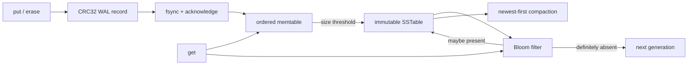

# lsm-tree

A dependency-free C++17 log-structured merge-tree storage engine built from
first principles.

[](https://github.com/asp53826/lsm-tree/actions/workflows/ci.yml)


> A write is not complete because it reached a map. It is complete when a
> restart can prove it survived.

## What is actually implemented

- acknowledged writes survive process crashes through an `fsync`-backed,
  checksummed WAL;
- sorted memtables flush to immutable, checksummed SSTables;
- Bloom filters reject absent keys before table lookup;
- newest-version-wins reads span memory and multiple disk generations;
- ordered range scans reconcile versions and tombstones across every layer;
- tombstones prevent deleted values from resurfacing;
- compaction durably installs a replacement before deleting old generations;
- incomplete WAL tails are detected and repaired to the verified record
  boundary;
- SSTable corruption is rejected instead of silently returning suspect data.



## Measured, not implied

Apple M2 Pro, macOS, Apple Clang 17:

| Check | Result |
|---|---:|
| Correctness assertions | **4,064 passed** |
| Seeded differential operations | 2,000 across five restarts |
| Randomized hard-crash rounds | 100 |
| Independently acknowledged writes lost | **0** |
| Synchronous write throughput | **34,708 ops/s** |
| Point-read throughput | **1.71M ops/s** |
| Benchmark records recovered | 20,000 / 20,000 |

The benchmark uses 20,000 writes and 20,000 seeded random reads. Writes call
`fsync`; reads run against immutable disk generations loaded into a compact
in-memory key index. These are local measurements, not universal hardware
claims.

## Verify it

```bash
make test
make crash-test
make benchmark
```

The crash campaign deliberately splits WAL and SSTable writes into seven-byte
chunks, kills the writer with uncatchable `SIGKILL` at seeded random times, and
compares every recovered state with a separately synced acknowledgement
oracle.

```bash
CRASH_ROUNDS=1000 make crash-test
```

## Disk structures

```text
active.wal
  [magic | sequence | put/delete | key_len | value_len | payload | CRC32]...

sst-N.dat
  [magic | version | entry_count | bloom metadata]
  [Bloom filter bytes]
  [sequence | tombstone | key_len | value_len | key | value]...
  [whole-file CRC32]
```

Flush ordering is deliberate: write temporary table → `fsync` table → atomic
rename → `fsync` directory → reset WAL. Compaction follows the same
install-before-delete rule and retains tombstones, so an interrupted cleanup
cannot expose an older value.

## Honest boundary

This is a compact educational engine, not a RocksDB replacement. It currently
has one writer, loads table indexes into memory, uses size-triggered full
compaction, and does not implement snapshots or concurrent readers. The tests
focus on the invariants those future features must preserve.

No database, serialization library, checksum package, Bloom-filter package, or
test framework is hidden behind the implementation.

## Why the write order is the design

The interesting part of an LSM tree is not putting values in `std::map`. It is
moving an acknowledged value from one durable representation to another
without creating a moment where neither copy is valid.

```text
put(key, value)
  1. append checksummed WAL mutation
  2. fsync WAL                         <-- acknowledgement boundary
  3. update ordered memtable

flush()
  4. write sst-N.dat.tmp in key order
  5. fsync temporary SSTable
  6. rename to sst-N.dat
  7. fsync database directory          <-- table name is now durable
  8. truncate + fsync active.wal
```

A crash before step 2 means the operation was never acknowledged. A crash
between 2 and 7 replays it from the WAL. A crash between 7 and 8 may leave the
same sequence in both places, which is harmless because sequence numbers make
replay idempotent. Only after the table and its directory entry are durable is
the old log discarded.

This is why the code uses POSIX file descriptors instead of `ofstream` for the
durability path. Flushing a C++ stream moves bytes to the kernel; it does not
establish the persistence boundary the API promises.

## SSTable anatomy

Tables are immutable after their temporary file is renamed. Opening a database
checks the whole-file CRC, validates every length, requires strictly increasing
keys, rejects values attached to tombstones, and refuses trailing bytes. A
corrupt table fails open; it is never silently skipped, because skipping a
newer generation could resurrect an older value.

The in-memory table index retains keys and values in this compact
implementation. A production successor would store sparse fence pointers and
read blocks on demand.

## Bloom filters

Each table chooses at least 64 bits and otherwise uses
`keys × bits_per_key`. Seven double-hashed probes are used at the default ten
bits per key. The second hash is forced odd so the probe sequence does not
collapse onto a small subset of a power-of-two bit array.

A negative result is definitive and skips the table search. A positive result
is only permission to look: false positives are expected. Tests query every
inserted key to establish zero false negatives, then issue absent lookups and
assert that the negative-hit counter moves.

## Reads and range scans

Point reads check the memtable first, then immutable generations newest to
oldest. Finding a tombstone ends the search; continuing would expose the value
that tombstone deleted.

`scan(begin, end)` performs last-sequence-wins reconciliation across the active
memtable and every immutable generation. It handles duplicate keys left by a
crash between table installation and WAL reset, removes tombstones only from
the returned view, and emits sorted keys in the half-open interval
`[begin, end)`. An empty end means no upper bound.

The test fixture updates one key in memory, deletes a second over an older
SSTable, scans before and after flush, reopens the database, compacts it, and
requires the same result at every stage.

## Why compaction retains tombstones

The engine writes a complete replacement generation and syncs it before
deleting sources. During a crash, replacement and sources may coexist.
Dropping a tombstone from the replacement would make lookup miss there, fall
through to an old source table, and resurrect the deleted value.

Retaining tombstones makes the overlap safe. Reclaiming them requires stronger
metadata proving that no older overlapping table contains the key. This engine
does not pretend to have that proof.

## Verification strategy

The 4,064 assertions include:

- values, overwrites and deletes across process reopen;
- newest-version-wins reads across multiple SSTables;
- range scans before flush, after flush, after reopen and after compaction;
- Bloom-filter no-false-negative checks;
- checksum rejection after single-byte SSTable corruption;
- damaged WAL tail repair;
- 2,000 seeded random mutations checked against `std::map` through five
  reopen cycles;
- automatic flush and compaction under a 90-byte memtable limit.

The crash harness is deliberately external. A Python parent launches a writer,
enables seven-byte physical writes, waits a seeded random interval, sends
uncatchable `SIGKILL`, and opens the database in another process. Every
independently synced oracle entry must still be readable.

The WAL can legitimately contain one more value than the oracle if the process
dies after database `fsync` but before oracle `fsync`. The harness treats that
interval as ambiguous success, never as loss.

## API

```cpp
lsm::Options options;
options.memtable_bytes = 64 * 1024;
options.bloom_bits_per_key = 10;
options.compaction_trigger = 4;

lsm::LSMTree db("data", options);
db.put("customer:42", "active");
db.erase("customer:17");

auto one = db.get("customer:42");
auto page = db.scan("customer:", "customer;");
db.flush();
db.compact();
```

## Repository map

```text
include/lsm/lsm.h       public API, options and statistics
src/lsm.cpp             WAL, recovery, Bloom filter, SSTables and scans
src/main.cpp            crash workload, oracle verifier and benchmark
tests/test_lsm.cpp       deterministic and randomized correctness suite
scripts/crash_torture.py external process-kill campaign
.github/workflows/ci.yml macOS/Linux tests, crashes and smoke benchmark
```

## What would come next

- block-based SSTables with sparse fence pointers and a block cache;
- leveled or size-tiered compaction instead of full-table merging;
- manifest/version sets for atomic table membership;
- snapshots and concurrent readers;
- background flush/compaction;
- prefix compression and restart points;
- tombstone collection once lower-level overlap is provably absent.

Each changes the recovery proof. They are listed rather than implied.
